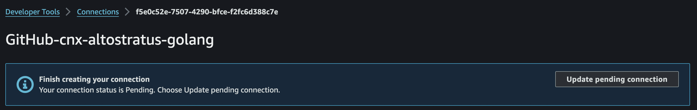

# Go API Infrastructure as Code

## Overview & Architecture
This repository contains the Terraform (IaC) configuration for deploying an AWS infrastructure for two distinct ECS Fargate services.
Each service has its own CodePipeline pipeline and implements a Blue/Green deployment strategy.
The services utilize AWS Secrets Manager for credentials and DynamoDB as the database solution.
<br><br>
This challenge was proposed by the Development Team of Altostratus Cloud Consulting.
<br>


## ECS Services to deploy
1. **API Service**
2. **Authentication Service**

Each service has its pipeline configuration allowing for continuous integration and deployment via AWS CodePipeline, integrating with GitHub for source control.

## Key Components
- **ECS Fargate**: Runs the services in a serverless Fargate cluster.
- **CodePipeline**: Orchestrates the CI/CD process for each service.
- **CodeBuild**: Builds Docker images and pushes them to ECR.
- **CodeDeploy**: Handles the deployment using a blue/green strategy.
- **Application Load Balancer**: Balances and routes traffic to the correct ECS services.
- **DynamoDB**: Serves as the database for the services.
- **Secrets Manager**: Secrets gets pulled from here by the ECS services.
- **ECR**: Stores Docker images.
- **CloudWatch**: Monitors and logs the services.
- **IAM Roles and Policies**: Ensures correct permissions for all services and tasks.

## Prerequisites
- AWS Account
- ```terraform``` installed
- Configured AWS CLI (Or properly set environment variables, see ```.env.example```)
- GitHub repository for source code (see: poner mis repos aqui)

## Setup
1. **Clone the Repository**: Start by cloning this repository to your local machine or cloud environment.
   ```bash
   git clone https://github.com/HakimHC/altostratus-golang-iac.git
   cd <path-to-repo>
   ```
2. **Initialize Terraform**:
   ```bash
   terraform init
   ```
3. **Apply the Terraform Configuration**:
   ```bash
   terraform apply
   ```
   Approve the plan when prompted to start the deployment.

### WARNING!!
After applying the configuration, you must approve the pending connection created by the Terraform config.
For this, you must go to the ```Developer Tools``` section in the AWS console and do the following:


Click on update pending connection and follow the instructions to configure the app on you profile.

## Configuration
The Terraform configuration is modular, and settings can be adjusted in the `variables.tf` file. Ensure all configurations, such as project and repository names, AWS regions, and resource specifics, align with your AWS setup.

## SPECIAL THANKS TO THE ALTOSTRATUS TEAM
I want to thank the Altostratus team for all of the resources provided in the bootcamp and for making this possible. Thank you.