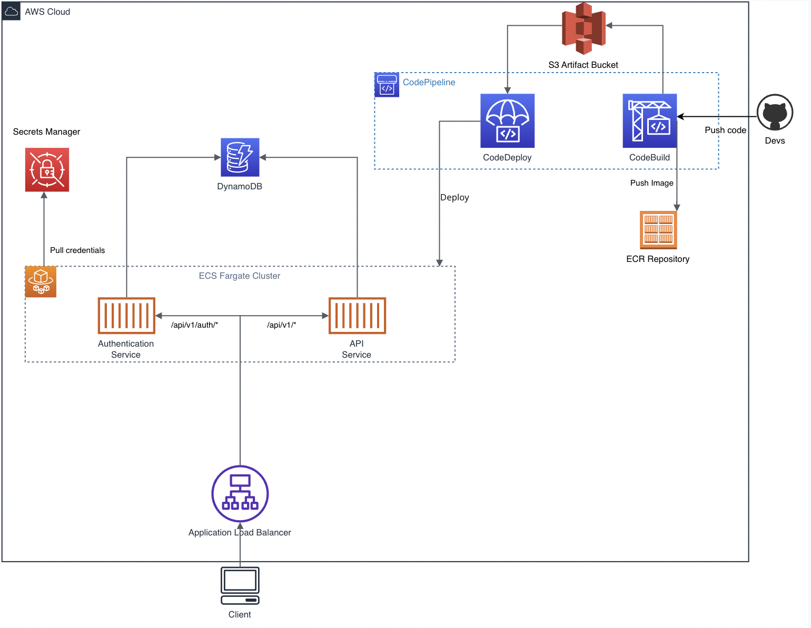

### Go API Challenge Infrastructure

#### Overview
This repository contains the Terraform (IaC) configuration for deploying an AWS infrastructure for two distinct ECS Fargate services.
Each service has its own CodePipeline pipeline and implements a Blue/Green deployment strategy.
The services utilize AWS Secrets Manager for credentials and DynamoDB as the database solution.



#### Services
1. **API Service**
2. **Authentication Service**

Each service has its pipeline configuration allowing for continuous integration and deployment via AWS CodePipeline, integrating with GitHub for source control.

#### Key Components
- **ECS Fargate**: Runs the services in a serverless Fargate cluster.
- **CodePipeline**: Orchestrates the CI/CD process for each service.
- **CodeBuild**: Builds Docker images and pushes them to ECR.
- **CodeDeploy**: Handles the deployment using a blue/green strategy.
- **Application Load Balancer**: Balances and routes traffic to the correct ECS services.
- **DynamoDB**: Serves as the database for the services.
- **Secrets Manager**: Secrets gets pulled from here by the ECS services.
- **ECR**: Stores Docker images.
- **CloudWatch**: Monitors and logs the services.
- **IAM Roles and Policies**: Ensures correct permissions for all services and tasks.

#### Prerequisites
- AWS Account
- ```terraform``` installed
- Configured AWS CLI (Or properly set environment variables, see ```.env.example```)
- GitHub repository for source code (see: poner mis repos aqui)

#### Initial Setup
1. **Approve GitHub Connection**: Ensure the AWS CodeStar Connections to GitHub are approved to allow AWS CodePipeline to access the repository.
2. **AWS Credentials**: Configure your AWS credentials for Terraform using the AWS CLI or environment variables.

#### Deployment Instructions
1. **Clone the Repository**: Start by cloning this repository to your local machine or cloud environment.
   ```bash
   git clone <repository-url>
   cd path/to/repository
   ```
2. **Initialize Terraform**:
   ```bash
   terraform init
   ```
3. **Create a Terraform Plan**:
   ```bash
   terraform plan
   ```
4. **Apply the Terraform Configuration**:
   ```bash
   terraform apply
   ```
   Approve the plan when prompted to start the deployment.

5. **Monitor Deployment**: Check AWS CodePipeline for the status of the deployment. Approve any manual approval steps if necessary.

#### Configuration
The Terraform configuration is modular, and settings can be adjusted in the `variables.tf` file. Ensure all configurations, such as project names, AWS regions, and resource specifics, align with your AWS setup.

#### Post-Deployment
After deployment, the ECS services will be operational, and any updates to the GitHub repository that holds the service code will trigger the pipelines to rebuild and redeploy the services.

#### Troubleshooting
For any deployment issues, refer to the CloudWatch logs for detailed error messages. Common issues may relate to IAM role permissions or resource limitations in your AWS account.

#### Contributing
Contributions to the IaC are welcome. Please follow the standard pull request process:
1. Fork the repository.
2. Make your changes in a feature branch.
3. Submit a pull request to the main branch.

For major changes, please open an issue first to discuss what you would like to change.

---

This README provides a general guide to the infrastructure setup using this repository. Adjustments may be needed based on specific use cases and AWS configurations.